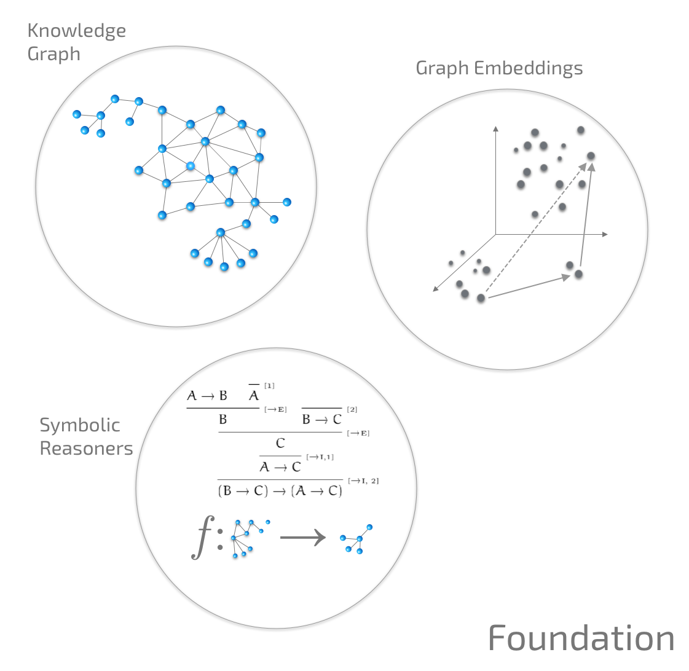
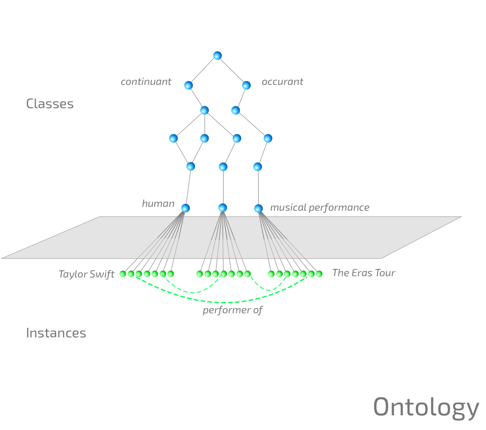
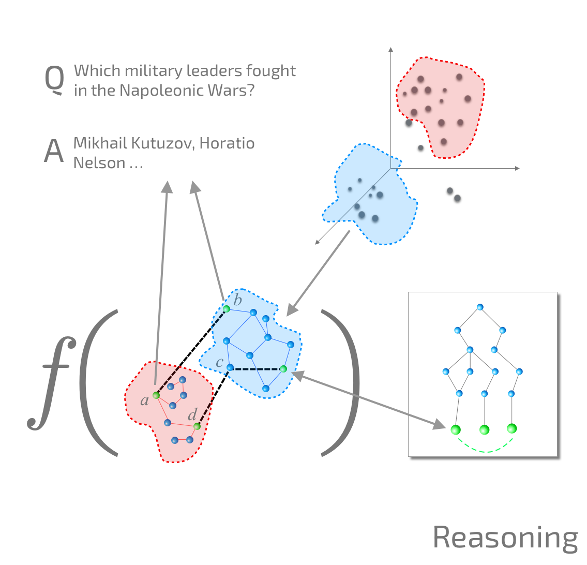
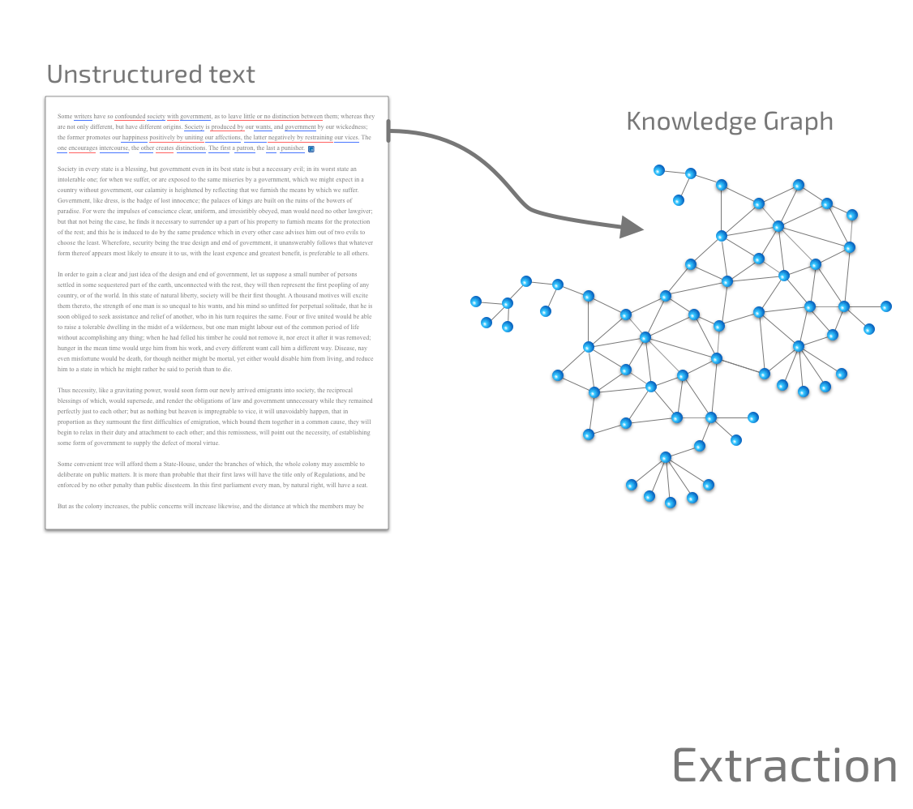

<div align="center">
<a href="https://zerolink.io"></a><br/>
<em>Making knowledge and reasoning universal</em>
</div>

# ZeroLink API

[](https://github.com/zerolink-io/zerolink-python/blob/main/Changelog.md)
[](https://zerolink.io)
[](https://github.com/zerolink-io/zerolink-python/actions/workflows/python-package.yml)
[](https://github.com/zerolink-io/zerolink-python/blob/main/LICENSE)
<!--
[](https://pypi.org/project/zerolink/)
-->

The ZeroLink Python library provides access for integrating knowledge model
reasoning into your applications.

ZeroLink is a knowledge graph question answering (KGQA) and knowledge modeling
platform that utilizes machine learning to provide fast, accurate and
explainable answers to complex questions with user-extensible reasoning.

ZeroLink can effortlessly translate structured data and unstructured text into
a computable knowledge graph. Connect ZeroLink with any type of content—be it
an article, website, Excel, PDF, SQL Database, Neo4j, or REST API, and
effortlessly map your content into a knowledge graph which you can then query
and reason about using natural language.

Host your data in your own VPC or use our [cloud offering](https://zerolink.io)
for a fully managed solution.

## Installation

Ensure you have Python 3.9 or higher installed on your machine. To install
ZeroLink's Python package, execute the following pip command:

```bash
% pip install git+https://github.com/zerolink-io/zerolink-python.git
```

After you have installed the package, import it within your Python application.
You will need to request an [API key](https://zerolink.io) for access to the
private beta.

```python
import zerolink as zl

zl.api_key = "00000000-0000-0000-0000-000000000000"

q = zl.ask("What is the capital of France?")
print(q.first())
```

If you are a ZeroLink Enterprise customer set `server_url` in ZeroLink config
to your private cloud deploy. For example:

```bash
% zerolink config set server_url zerolink-526947398.us-east-1.elb.amazonaws.com
% zerolink config set enable_aws true
```

## Quickstart

For more examples of knowledge graph creation and querying see the
[examples](./examples) folder. To create a basic knowledge graph:

```python
import zerolink as zl

kg = zl.create_kg("demo")

e1 = kg.add_entity("Alice", type=zl.EntityType.PERSON)
e2 = kg.add_entity("Bob", type=zl.EntityType.PERSON)

kg.add_fact(e1, "spouse", e2)

result = kg.ask("Who is Alice married to?")
print(result.first())
```

## Foundation

The **Foundation** knowledge graph and ontology contains a curated collection
of over 17 billion entities, facts, attributes, relations and reasoners that
make up a fundamental world model that can serve as the foundation to user
knowledge models. The data is derived from [CC0 sources](https://creativecommons.org/public-domain/cc0/), 
and incorporates a computable form of the entire Wikipedia corpus.

<div align="center">

</div>

The Foundation knowledge graph can be queried to find entities, relations and
answer many different types of queries. These entities can be linked against
user knowledge graph provide to ontological context and enhance reasoning
capacities.

```python
import zerolink as zl

zl.foundation.entity("Steve Jobs")
zl.foundation.property("birth place")
zl.foundation.reasoner("spatio-temporal")

zl.ask("Where was Steve Jobs born?")
zl.ask("What subatomic particles have spin 1/2?")
zl.ask("Which movie directed by Steven Spielberg did not star Tom Hanks?")
zl.ask("What international organisations contain the country of nationality of Issac Newton?")
zl.ask("Where is the stadium of the team that won the 1946 World Series?")
zl.ask("Which cell component has a subcellular localization in the plasma membrane?")
```

Since this is a knowledge graph question answering system (contrasted with
stochastic language models) the answers given are deterministic, grounded and
explainable based on four key principles:

1. The system must be able to produce an explanation.
2. The explanation must be meaningful to humans.
3. The explanation must reflect the system's processes accurately.
4. The system must express its knowledge limits.


<div align="center">

</div>

For example, every answer produces an explanation of its derivation including
all of the steps used by the reasoner. The verbalization is performed using
a seq2seq transformer that maps the proof tree into English. The proof of a
given answer can be derived using the `explain` function on the result set.

```python
import zerolink as zl

result = zl.ask("Who is the wife of George Bush?")
print(result.first().id)
print(result.first().explain())
```

The answer given is a set of entities (this example has Laura Bush as
`E2016458`) from the knowledge graph.

```
E2016458
Laura Bush
```

The explanation is a verbalization of the logical derivation tree for a given
answer.

```
From a ground truth in the knowledge graph, we know that "Laura Bush has spouse
George W. Bush". By applying the symmetric property of the "spouse"
relationship, we can conclude that "George W. Bush has spouse Laura Bush".
```

One of the major advantages of using a KGQA system over a stochastic language
model is that it is fundamentally grounded to the knowledge contained within the
graph and by design cannot hallucinate or confabulate answers. Additionally the
system can be extended and updated in real-time without the need for expensive
model training.

A KGQA system is designed to only answer questions which can be provably derived
from ground truths within the knowledge graph.

```python
import zerolink as zl

result = zl.ask("How many angels can dance on the head of a pin?")
print(result)
```

```
The question is not answerable within the current knowledge graph.
```

Questions which involve assertions are either `Falsifiable`, `Unsatisfiable` or
`Satisfiable` in addition to the truth value returned. For example:

```python
import zerolink as zl

result = zl.ask("Is Paris the capital of Belgium?")
print(result.first().explain())
```

```
The answer is no, this is falsifiable. The proof for this conclusion is as
follows: Firstly, it is established that no fact exists such that Belgium has
capital Paris. This is supported by the following points: 1. The property
"capital" is singular, meaning that a country can have only one capital city. 2.
Paris is an current entity and France has capital Paris. 3. It is also a fact
that Belgium has capital City of Brussels. 4. Additionally, Paris and Belgium
are not identical entities. From these points, it is clear that since Belgium
already has a capital, which is the City of Brussels, and because a country can
have only one capital, Paris cannot be the capital of Belgium.
```

## Knowledge Graph Reasoning

In ZeroLink *neurosymbolic reasoners* are symbolic functions over algebraic
graph expressions containing graph nodes, embeddings and their ontological
connections. Reasoners allow deductions of facts not contained in the graph to
be deduced from facts that are contained within the graph.

Using the global Foundation knowledge graph and ontology as a starting point, we
can add new reasoners to extend question answering over the knowledge graph in
customizable and user-definable ways.

<div align="center">

</div>

For example we can add two rules to the knowledge graph: "All humans are
mortal" and "Socrates is a human", the classic syllogism from elementary logic.
These rules extend the capacity of the reasoning system over the user knowledge
graph. The text given is translated into an internal logical representation
using a seq2seq transformer.

We can then make a query to the knowledge graph asking "Is Socrates mortal?".
The `ask` function checks the facts, rules, ontology and their deduced
implications within the knowledge graph and returns the explanation.

```python
import zerolink as zl

# Create a knowledge graph
kg = zl.create_kg("demo")

ctx = {
    "Socrates" : zl.foundation.entity("Socrates"),
    "mortal"   : zl.foundation.entity("mortality"),
    "human"    : zl.foundation.entity("human"),
    "Greek"    : zl.foundation.entity("Greece"),
    "citizen"  : zl.foundation.relation("country of citizenship"),
}

# Define our rules
kg.add_rule("All humans have characteristic mortal", ctx=ctx)
kg.add_rule("All Greek citizens are human", ctx=ctx)
kg.add_rule("Socrates is a Greek citizen", ctx=ctx)

# Query the knowledge graph
result = kg.ask("Is Socrates mortal?")
print(result)
print(result.explain())
```

The answer and its derivation are outputted. For more sophisticated
examples see the [examples](./examples) folder.

## Knowledge Graph Construction

ZeroLink supports construction of user knowledge graph from data connectors and
from unstructured text. The resolved entities and relations are mapped against
the Foundation knowledge graph in addition to user-specified entities.

<div align="center">

</div>

For example we could consume the Wikipedia article on [Burgundy
wine](https://en.wikipedia.org/wiki/Burgundy_wine) and incorporate it into a
local knowledge graph. In this example the entity Burgundy exists in foundation
as entity `E33481985` and thus the new facts are linked against the existing
entity. By automatically linking new knowledge against existing knowledge and
our ontology we gain enhanced reason capacities.

```python
import zerolink as zl

kg = zl.create_kg("demo")

text = """
Burgundy wine is made in the Burgundy region of eastern France, in the valleys
and slopes west of the Saône, a tributary of the Rhône. The most famous wines
produced here, and those commonly referred to as "Burgundies," are dry red wines
made from pinot noir grapes and white wines made from chardonnay grapes.

Red and white wines are also made from other grape varieties, such as gamay and
aligoté, respectively. Small amounts of rosé and sparkling wines are also
produced in the region. Chardonnay-dominated Chablis and gamay-dominated
Beaujolais are recognised as part of the Burgundy wine region, but wines from
those subregions are usually referred to by their own names rather than as
"Burgundy wines".
"""

facts = kg.extract(text)
print(facts)

result = kg.ask("What types of grapes are used in Burgandy wine?")
for answer in result:
    print(answer)
```

The extraction model depends on a set of assumptions to contextualize the
entities in a given text. To set the extraction model use the model argument
and select on of the given text models `BASE`, `FINANCE`, `GENOMICS`,
`INSURANCE`, or `LEGAL`. Base is the most general model and will work on a wide
variety of texts.

```python
kg.extract(text, model=zl.ExtractModel.FINANCE)
```

If a given text is about a single entity use the `attach` keyword to assign all
facts to a given subject.

```python
kg.extract(text, attach=zl.foundation.entity("Château Latour"))
```

## Command-line interface

This library additionally provides an command-line utility to interact with the
API from your terminal.

Run `zerolink --help` for usage.


```bash
% zerolink --help

Usage: zerolink [OPTIONS] COMMAND [ARGS]...

  ZeroLink client.

Options:
  --version  Show the version and exit.
  --help     Show this message and exit.

Commands:
  api          Direct API calls.
  billing      Billing operations.
  completion   Generate shell completions.
  config       Configuration options.
  connectors   Connector operations.
  embedding    Graph embedding operations.
  fine-tuning  RLHF and fine-tuning API.
  key          Set the api key.
```

**Access key setup**:

```bash
% zerolink key
Enter key: 00000000-0000-0000-0000-000000000000
Key saved to /Users/demo/.config/zerolink/config
```

**Question API**:

Ask a question via the CLI:

```bash
% zerolink api ask "Who are the members of the Royal Society who are women?"
```

**Fine-tuning API**

See [TUNING.md](TUNING.md) for more details.

```bash
% zerolink fine-tune create training_file.jsonl
```

**Entity API**:

Disambiguate entities by name in the knowledge graph.

```bash
% zerolink api entity "Microsoft" --limit 15
Microsoft : (E2024889)
Microsoft 365 : (E49348480)
Microsoft XNA : (E25616386)
Microsoft Bob : (E17640024)
Microsoft .NET : (E17942177)
Microsoft Word : (E33483102)
Microsoft Bing : (E20594)
Microsoft Edge : (E18586489)
Microsoft Excel : (E1304)
Microsoft Store : (E25541550)
Microsoft Azure : (E70190)
Microsoft Paint : (E33515989)
Microsoft Store : (E25676558)
Microsoft Mobile : (E34345200)
Microsoft Teams : (E11233816)
```

## License

```
Copyright 2020-2023 ZeroLink Inc.

Licensed under the Apache License, Version 2.0 (the "License");
you may not use this file except in compliance with the License.
You may obtain a copy of the License at

    http://www.apache.org/licenses/LICENSE-2.0

Unless required by applicable law or agreed to in writing, software
distributed under the License is distributed on an "AS IS" BASIS,
WITHOUT WARRANTIES OR CONDITIONS OF ANY KIND, either express or implied.
See the License for the specific language governing permissions and
limitations under the License.
```
